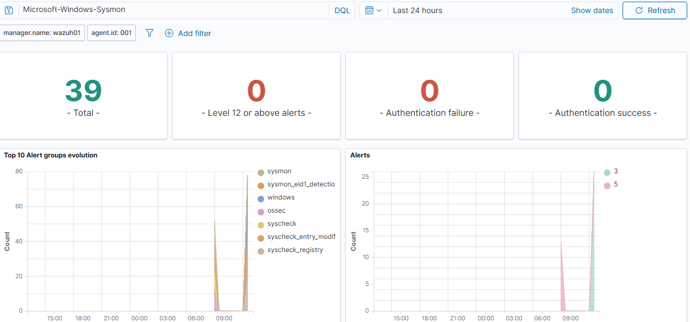
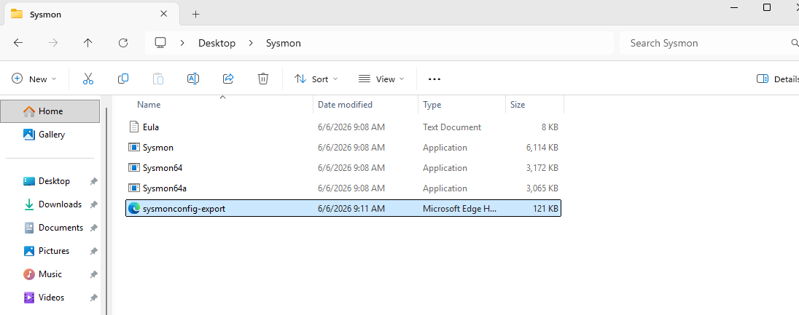
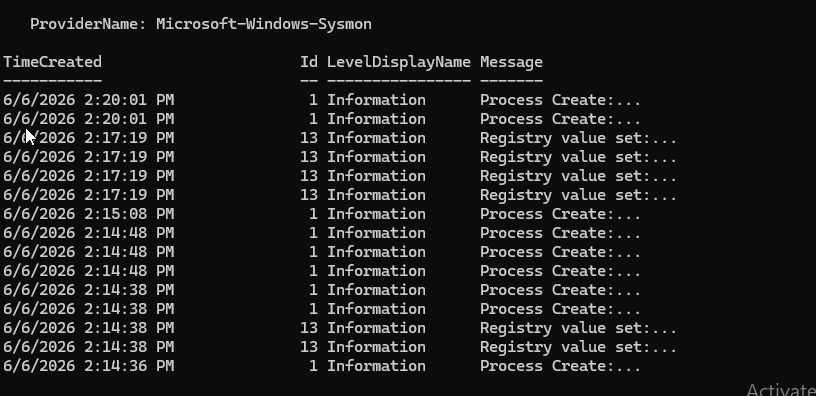
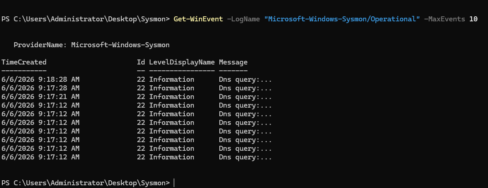
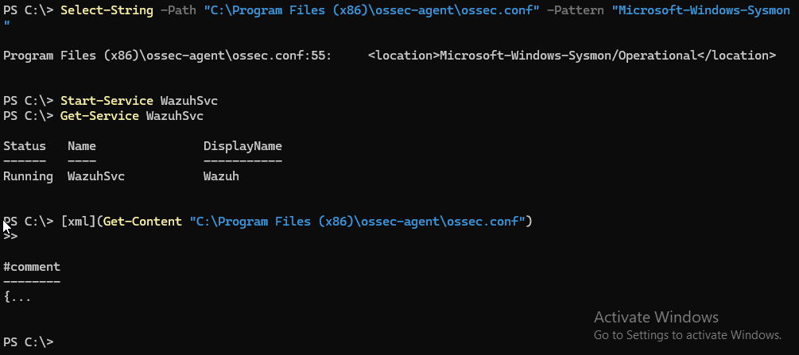
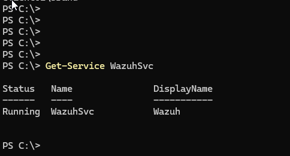
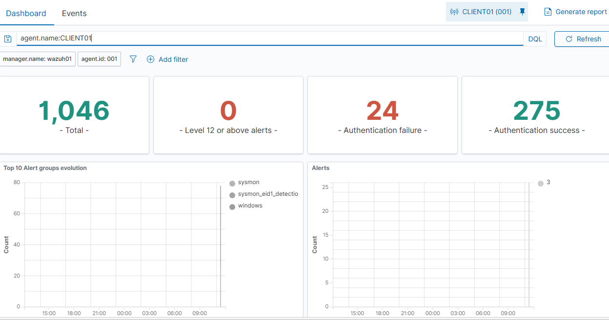
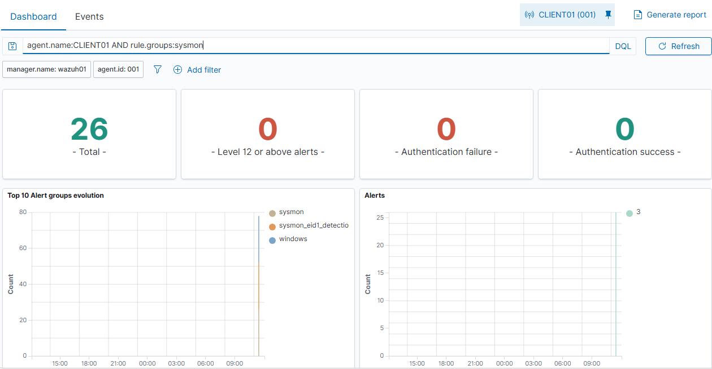
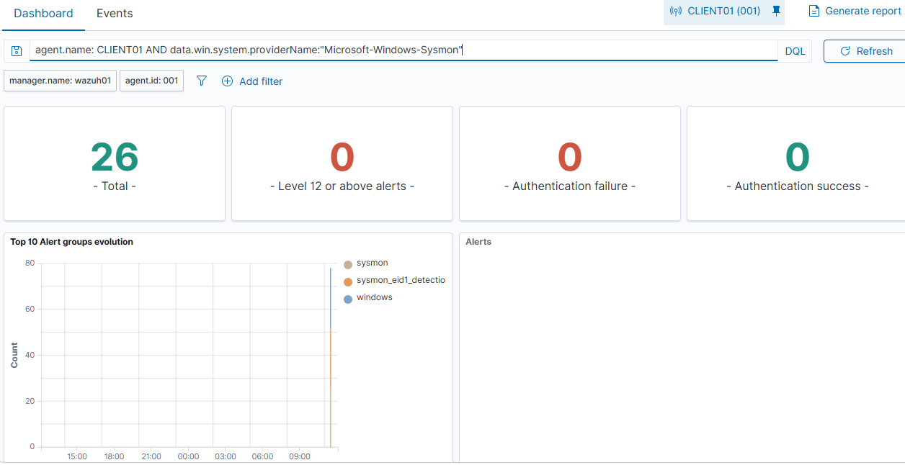

# 🛡️ Wazuh + Sysmon Detection Lab

A Security Operations Center (SOC) homelab built using:

- Wazuh SIEM
- Windows Server 2025 Active Directory
- Windows 11 Endpoint
- Sysmon
- Threat Hunting & Detection Engineering

This project demonstrates endpoint monitoring, log collection, Sysmon telemetry ingestion, threat detection, and troubleshooting within a Windows enterprise environment.

---

# Lab Architecture

```text
+-----------------------+
| Windows Server 2025   |
| DC01                  |
| Active Directory      |
+-----------+-----------+
            |
            |
            |
+-----------v-----------+
| CLIENT01              |
| Windows 11 Endpoint   |
| Sysmon Installed      |
| Wazuh Agent           |
+-----------+-----------+
            |
            |
            |
+-----------v-----------+
| Wazuh SIEM            |
| Manager + Dashboard   |
| Threat Hunting        |
+-----------------------+
```

# Dashboard Overview



---

# Objectives

- Deploy Sysmon on a Windows endpoint
- Configure Wazuh to ingest Sysmon logs
- Verify Sysmon telemetry collection
- Generate endpoint activity
- Validate detections in Wazuh
- Perform basic threat hunting
- Document troubleshooting process

---

# Technologies Used

| Technology | Purpose |
|------------|----------|
| Wazuh | SIEM |
| Sysmon | Endpoint Telemetry |
| Active Directory | Identity Infrastructure |
| Windows Server 2025 | Domain Controller |
| Windows 11 | Monitored Endpoint |
| PowerShell | Administration |
| Windows Event Logs | Log Source |

---

# Deployment Process

## 1. Download Sysmon

Downloaded Sysmon from Microsoft Sysinternals.



---

## 2. Install Sysmon

Installed Sysmon with SwiftOnSecurity configuration.

```powershell
.\Sysmon64.exe -accepteula -i .\sysmonconfig-export.xml
```



---

## 3. Validate Sysmon Telemetry

Verified Sysmon was generating process creation and registry events.

```powershell
Get-WinEvent -LogName "Microsoft-Windows-Sysmon/Operational"
```



---

## 4. Configure Wazuh Agent

Added Sysmon event channel collection to:

```xml
<localfile>
    <location>Microsoft-Windows-Sysmon/Operational</location>
    <log_format>eventchannel</log_format>
</localfile>
```



---

## 5. Verify Agent Health

Confirmed Wazuh agent service was running.



---

## 6. Verify Endpoint Connectivity

Confirmed CLIENT01 was reporting to Wazuh.



---

## 7. Validate Sysmon Detections

Queried Sysmon detection groups.

```text
agent.name:CLIENT01 AND rule.groups:sysmon
```



---

## 8. Verify Sysmon Event Ingestion

Queried events generated by the Sysmon provider.

```text
data.win.system.providerName:"Microsoft-Windows-Sysmon"
```



---

## 9. Threat Hunting Dashboard

Performed basic threat hunting using Sysmon telemetry.


---

# Sysmon Event Analysis

The following Sysmon events were observed after deployment.

| Event ID | Description |
|-----------|------------|
| 1 | Process Creation |
| 3 | Network Connection |
| 7 | Image Loaded |
| 11 | File Creation |
| 13 | Registry Value Set |
| 22 | DNS Query |

Examples observed during testing:

- Event ID 1 (Process Creation)
- Event ID 13 (Registry Modification)
- Event ID 22 (DNS Query)

These events were successfully ingested into Wazuh and correlated with Sysmon detection rules.

---

# MITRE ATT&CK Mapping

| Technique | Description |
|------------|------------|
| T1059 | Command and Scripting Interpreter |
| T1112 | Modify Registry |
| T1071 | Application Layer Protocol |
| T1046 | Network Service Discovery |
| T1082 | System Information Discovery |

---

# Lab Results

The deployment successfully achieved the following:

- Sysmon v15 installed on CLIENT01
- Sysmon Operational event channel enabled
- Wazuh agent configured to collect Sysmon telemetry
- Process creation events detected
- Registry modification events detected
- DNS query events detected
- Sysmon alerts visible within Wazuh dashboard
- Threat hunting queries validated

Total Sysmon detections observed: 39

---

# Troubleshooting

## Issue #1

### Sysmon XML Configuration Failed

Error:

```text
Failed to open xml configuration
```

Root Cause:

File extension was accidentally saved as:

```text
sysmonconfig-export.xml.xml
```

Resolution:

Renamed file to:

```text
sysmonconfig-export.xml
```

---

## Issue #2

### Wazuh Agent Failed to Start

Error:

```text
Error reading XML file 'ossec.conf'
```

Root Cause:

Malformed XML entry while adding Sysmon event channel.

Incorrect:

```xml
<location>Microsoft-Windows-Sysmon/Operational<\location>
```

Correct:

```xml
<location>Microsoft-Windows-Sysmon/Operational</location>
```

Resolution:

Corrected XML syntax and restarted the agent.

---

## Issue #3

### Sysmon Events Not Appearing in Wazuh

Symptoms:

- Sysmon working locally
- Wazuh receiving Windows logs
- No Sysmon events visible

Resolution:

Verified:

```powershell
Select-String -Path "C:\Program Files (x86)\ossec-agent\ossec.conf" `
-Pattern "Microsoft-Windows-Sysmon"
```

Confirmed Sysmon event channel collection was enabled and restarted Wazuh service.

---

# Security Outcomes

This lab demonstrates the ability to:

- Collect endpoint telemetry
- Centralize security logs
- Detect suspicious activity
- Validate telemetry ingestion
- Troubleshoot security tooling
- Perform basic threat hunting
- Investigate endpoint events

---

# Skills Demonstrated

- SIEM Deployment
- Windows Event Logging
- Sysmon Configuration
- Detection Engineering
- Threat Hunting
- PowerShell
- Active Directory
- Endpoint Monitoring
- Security Troubleshooting
- Incident Investigation

---

# Resume Highlights

- Built a Windows Active Directory lab consisting of Windows Server 2025, Windows 11 endpoint, Sysmon, and Wazuh SIEM.
- Configured Sysmon endpoint telemetry and integrated event collection into Wazuh.
- Validated process creation, registry modification, and DNS query events through centralized monitoring.
- Performed threat hunting using Sysmon telemetry and Wazuh dashboards.
- Troubleshot XML configuration errors, agent communication issues, and event ingestion failures.

---

# Future Improvements

- Sigma Rule Integration
- MITRE ATT&CK Mapping
- Custom Sysmon Detection Rules
- PowerShell Detection Use Cases
- Brute Force Detection
- Persistence Detection
- Lateral Movement Detection
- Sysmon Event ID Analysis

---

## Author

Brandon Cooper

Cybersecurity Professional focused on:

- SOC Operations
- Threat Detection
- Incident Response
- Digital Forensics
- Windows Security Monitoring

GitHub:
https://github.com/brandonjcooper1981-code

LinkedIn:
https://www.linkedin.com/in/brandon-cooper-070526375
